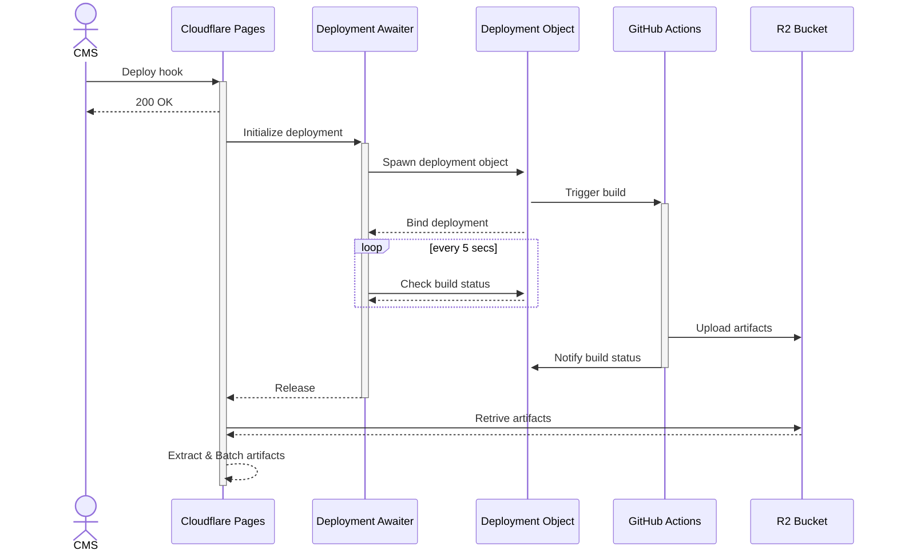

# 웹사이트 배포 구성

- Build: GitHub Actions
- Deployment: Cloudflare Pages

CI/CD 가 통합된 플랫폼 전체 기능을 있는 그대로 사용하는 대신 필요에 따라 커스텀한 구성을 사용합니다.

## Motivation

Cloudflare Pages나 Vercel 등 통합 플랫폼이 자체적으로 빌드 시스템을 제공하지만 몇몇 사이트는 제약사항 있는 그대로 사용하기에 한계가 있습니다. 대표적으로 `about.daangn.com` 의 경우 전체 700MB 정도의 아티팩트 사이즈, 빌드 과정 중 무거운 이미지 빌드가 많다보니 제약사항이 생깁니다.

e.g) 발견된 제약사항 예시

- 클린 빌드와 캐시 빌드가 엄청나게 차이남 (거의 2분 vs 45분)
- CI의 빌드 캐시 여부를 커스터마이징 할 수 없음
- CI가 빌드 중 메모리 제약으로 실패함
- CI가 빌드 중 시간을 너무 많이 써서 타임아웃으로 실패함
- 외부에서 빌드해서 업로드만 하는 것을 지원하지 않음
- 외부에서 빌드해서 업로드하는 것을 지원하나, 업로드 가능한 바이트 수에 제한이 있음

## Build Caching

Cron 스케줄을 통해 매일 빌드 캐시를 만들어 Actions Cache로 저장합니다.

컨텐츠 수명이 길어 빌드 빈도를 높게 가져가는 것이 큰 효용은 없습니다.

반면, Actions Cache는 프로젝트 별로 10GB의 저장소 제약이 있습니다. 모든 웹사이트가 캐시를 유지하여도 충분하도록, 불변 캐시를 만드는 대신 매번 기존 캐시를 덮어 씁니다.

## Configuration

(Enterprise 도메인이 있는 경우) Cloudflare Pages를 주 플랫폼으로 사용합니다.

구성을 위해 필요한 기능들(Deployment webhook, Custom build script, Branch preview)을 동등하게 제공하는 다른 배포 플랫폼을 사용할 수 있습니다.

### Components

Shared config:
- R2 artifacts bucket
- Cloudflare Worker for integration

Per-site config:

- GitHub Actions "cache" worfklow
- GitHub Actions "build" workflow
- Cloudflare Pages Project

### How it works

전체 사이트 배포의 세부적인 프로세스는 다음과 같습니다.

동작 방식은 프로덕션과 브랜치 프리뷰가 동일합니다.
