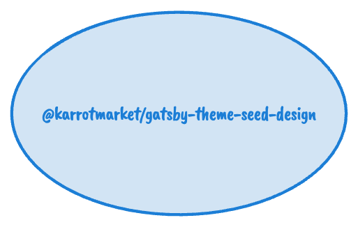

# @karrotmarket/gatsby-theme-seed-design

## Roles

- [`gatsby-plugin-seed-design`](https://github.com/daangn/seed-design/blob/main/packages/gatsby-plugin-seed-design)을 통합합니다.
- [`@seed-design/icon`](https://github.com/daangn/seed-design/tree/main/packages/icon)으로 자주 사용하는 아이콘 목록을 사전 생성/관리 합니다.
- 사전 생성된 아이콘 에셋을 프리로딩 하도록 `<link>` 를 삽입합니다.

## Theme Composition

