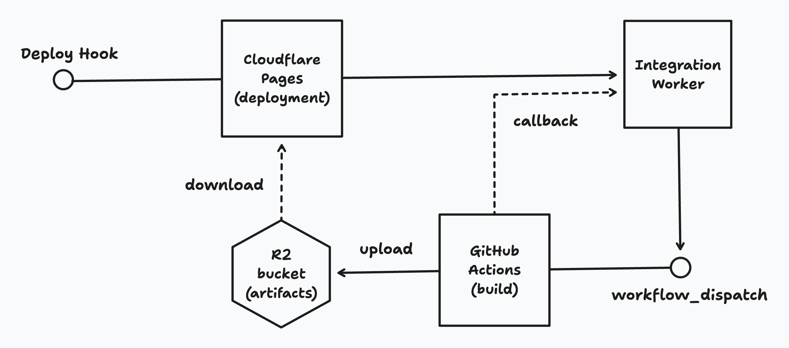
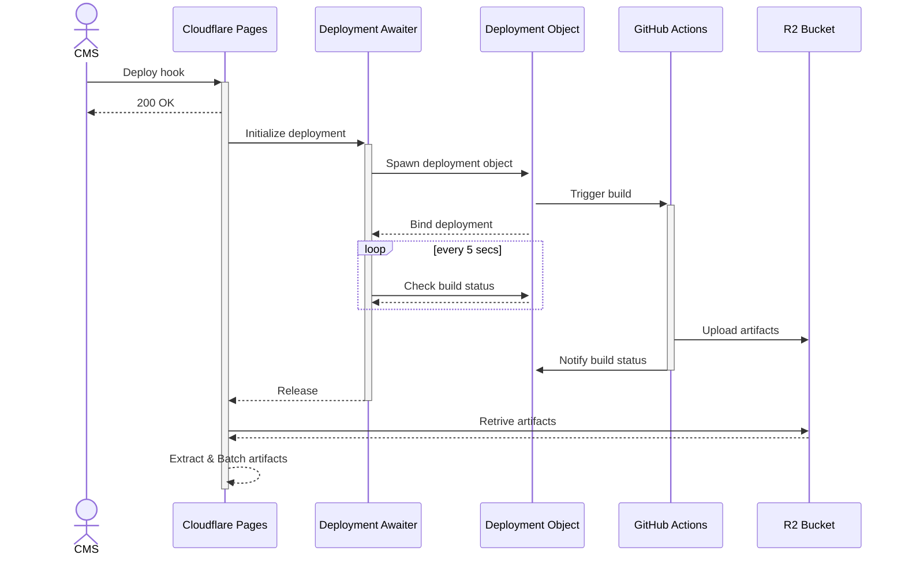

# websites-integration

websites 모노레포 CI/CD 통합을 위한 스케줄러

- Build: GitHub Actions
- Deployment: Cloudflare Pages

## Motivation

Cloudflare Pages나 Vercel 등 통합 플랫폼이 자체적으로 빌드 시스템을 제공하지만 제약사항이 많아 있는 그대로 사용하기에 한계가 있습니다. 대표적으로 `about.daangn.com` 사이트의 경우 전체 700MB 정도의 아티팩트 사이즈, 빌드 과정 중 무거운 이미지 빌드가 많다보니 제약사항이 생깁니다.

e.g) 발견된 제약사항 예시

- 클린 빌드와 캐시 빌드가 엄청나게 차이남 (거의 2분 vs 45분)
- CI의 빌드 캐시 여부를 커스터마이징 할 수 없음
- CI가 빌드 중 메모리 제약으로 실패함
- CI가 빌드 중 시간을 너무 많이 써서 타임아웃으로 실패함
- 외부에서 빌드해서 업로드만 하는 것을 지원하지 않음
- 외부에서 빌드해서 업로드하는 것을 지원하나, 업로드 가능한 바이트 수에 제한이 있음

## Build Caching

Cron 스케줄을 통해 매일 빌드 캐시를 만들어 Actions Cache로 저장합니다.

컨텐츠 수명이 길어 캐시 주기를 짧게 가져가는 것은 큰 효용이 없습니다. 반면, Actions Cache는 프로젝트 별로 10GB의 저장소 제약이 있습니다.

따라서 모든 웹사이트가 캐시를 유지하여도 충분하도록, 불변 캐시를 만드는 대신 주기적으로 기존 캐시를 덮어 씁니다.

## Configuration



(Enterprise 도메인이 있는 경우) Cloudflare Pages를 주 플랫폼으로 사용합니다.

구성을 위해 필요한 기능들(Deployment webhook, Custom build script, Branch preview)을 동등하게 제공하는 다른 배포 플랫폼이 있다면 똑같이 사용할 수 있습니다.

### Components

Shared config:

- R2 artifacts bucket
- Cloudflare Worker (`websites-integration`)

Per-site config:

- GitHub Actions "cache" worfklow
- GitHub Actions "build" workflow
- Cloudflare Pages Project

### Usage

원하는 사이트(예시: `my-site.com`) 워크스페이스에 `websites-integration`을 종속성으로 추가합니다.

```bash
yarn workspace my-site.com add -D websites-integration@workspace:^
```

사이트 빌드를 수행하는 GitHub Actions workflow 파일도 추가해야합니다. 워크플로우는 `websites-integration` 워커로부터 실행되어 빌드를 수행하고,  출력결과물을 `.tar.zst` 형식으로 압축하여 업로드하고, 결과를 보고해야 합니다.

```yml
# e.g. my_site_com-build.yml
name: Build my-site.com

on:
  workflow_dispatch:
    inputs:
      deployment_id:
        description: Deployment ID
        type: string
        required: true
      bind_url:
        description: Bind URL from the websites-deployment worker
        type: string
        required: true
      callback_url:
        description: Callback URL from the websites-deployment worker
        type: string
        required: true

jobs:
  build:
    name: Build
    runs-on: ubuntu-latest
    steps:
      - name: Bind this to the deployment
        run: |
          curl -fsSL -X POST \
            -H "Authorization: AdminKey ${{ secrets.WEBSITES_ADMIN_KEY }}" \
            -H "Content-Type: application/json" \
            -d '{ "run_id": "${{ github.run_id }}" }' \
            "${{ inputs.bind_url }}"

      - uses: actions/checkout@v4

      - name: Setup Rclone
        uses: cometkim/rclone-actions/setup-rclone@main
        env:
          GITHUB_TOKEN: ${{ secrets.GITHUB_TOKEN }}

      - name: Configure Rclone
        run: |
          mkdir -p ~/.config/rclone
          {
            echo "[r2]"
            echo "type = s3"
            echo "provider = Cloudflare"
            echo "access_key_id = ${{ secrets.CLOUDFLARE_R2_ACCESS_KEY_ID }}"
            echo "secret_access_key = ${{ secrets.CLOUDFLARE_R2_SECRET_ACCESS_KEY }}"
            echo "endpoint = https://${{ secrets.CLOUDFLARE_ACCOUNT_ID }}.r2.cloudflarestorage.com"
            echo "acl = private"
          } > ~/.config/rclone/rclone.conf

      - name: Setup Node.js
        uses: actions/setup-node@v4
        with:
          node-version: 20
          cache: yarn

      - name: Install Dependencies
        run: yarn install --immutable

      - name: Restore cache
        id: content-cache
        uses: actions/cache/restore@v4
        with:
          path: |
            my-site.com/public
            my-site.com/.cache
          key: cache-my-site

      - name: Build my-site.com
        id: build
        run: yarn workspace my-site.com build

      - name: Build artifact
        run: |
          cd my-site.com && \
          tar --use-compress-program="zstd -T0 --adapt --exclude-compressed" \
            -cvf "public.tar.zst" \
            "public/"

      - name: Upload artifact
        run: |
          cd my-site.com && \
          rclone copyto \
            --transfers 8 \
            --checkers 50 \
            --buffer-size 128M \
            --s3-chunk-size 128M \
            --s3-upload-concurrency 8 \
            --log-level INFO \
            --stats 5 \
            "public.tar.zst" \
            "r2:websites-artifacts/my-site.com/${{ inputs.deployment_id }}.tar.zst"

      - name: Execute callback
        if: ${{ always() }}
        run: |
          curl -fsSL -X POST \
            -H "Authorization: AdminKey ${{ secrets.WEBSITES_ADMIN_KEY }}" \
            -H "Content-Type: application/json" \
            -d '{ "run_id": "${{ github.run_id }}", "status": "${{ job.status }}", "artifact_name": "my-site.com/${{ inputs.deployment_id }}.tar.zst" }' \
            "${{ inputs.callback_url }}"
```

그리고 해당 워크스페이스 `package.json`에 다음과 같이 스크립트를 추가합니다.

```json
{
  "name": "my-site.com",
  "scripts": {
    "websites-integration:deployment": "deployment-awaiter --workflow my-site-com-build.yml"
  }
}
```

배포 플랫폼에서 빌드 스크립트로 `yarn workspace my-site.com websites-integration:deployment`를 지정합니다.

빌드가 완료되면 워크스페이스 경로에 배포 가능한 `public/` 디렉토리가 생성됩니다.

### How it works

전체 사이트 배포의 세부적인 프로세스는 다음과 같습니다.



동작 방식은 프로덕션과 브랜치 프리뷰가 동일합니다.

